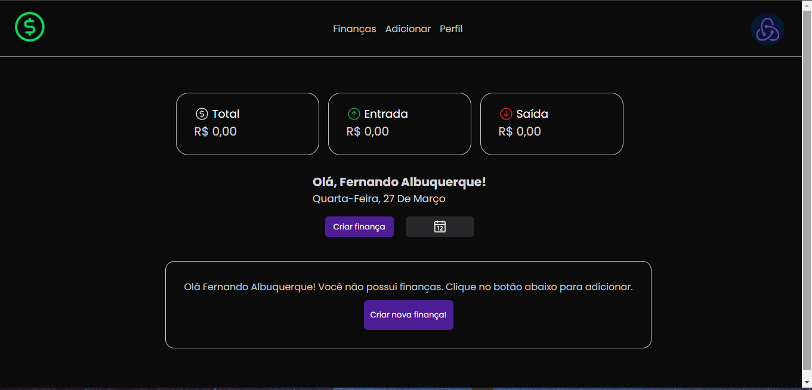

<div id="top"></div>

<!-- PROJECT SHIELDS -->
<!-- https://www.markdownguide.org/basic-syntax/#reference-style-links-->
<div align="center">

[![LinkedIn][linkedin-shield]][linkedin-url]

</div>

<!-- PROJECT LOGO -->
<br />
<!-- UPDATE -->
<div align="center">
  <a href="https://github.com/proffapt/PROJECT_NAME">
    
  </a>

  <h3 align="center">DevFinances</h3>

  <p align="center">
  <!-- UPDATE -->
    <i>Gerenciador de finanças pessoais!</i>
    <br />
    <a href="https://github.com/fernandoAlbuquerque3/finances-dashboard"><strong>Explorar projeto »</strong></a>
    <br />
    <br />
    <a href="https://github.com/fernandoAlbuquerque3/finances-dashboard/issues">Reportar Bug</a>
    ·
    <a href="https://github.com/fernandoAlbuquerque3/finances-dashboard/issues">Request Feature</a>
  </p>
</div>

<!-- TABLE OF CONTENTS -->
<details>
<summary>Tabelas de conteúdo</summary>

- [Sobre o projeto](#about-the-project)
  - [Supports](#supports)
- [Começar a usar](#getting-started)
  - [Pre-requisitos](#prerequisites)
  - [Installation](#installation)
- [Usage](#usage)
- [Contato](#contact)

</details>

<!-- ABOUT THE PROJECT -->

## Sobre o projeto

<!-- UPDATE -->
<div align="center">
  <a href="https://github.com/proffapt/PROJECT_NAME">
    
  </a>
</div>

_Projeto para gerenciar finanças pessoais filtrando por data e por tipo de finança, entrada ou saída._

<p align="right">(<a href="#top">Voltar ao topo</a>)</p>

<div id="supports"></div>

### Supports:

1. Shells
   - `bash`
   - `fish`
   - `zsh`
2. OS(s)
   - `MacOS`[`BSD` based]
   - any `*nix`[`GNU+Linux` and `Unix`]

<p align="right">(<a href="#top">Voltar ao topo</a>)</p>

<!-- GETTING STARTED -->

## Começar a usar

To set up a local instance of the application, follow the steps below.

### Pre-requisitos

<!-- UPDATE -->

The following dependencies are required to be installed for the project to function properly:

- npm
  ```sh
  npm install npm@latest -g
  ```

<p align="right">(<a href="#top">back to top</a>)</p>

### Instalação

_Agora que o ambiente foi configurado e ajustado para compilar e executar o projeto corretamente, o próximo passo é instalar e configurar o projeto localmente em seu sistema._

<!-- UPDATE -->

1. Clone the repository
   ```sh
   git clone https://github.com/fernandoAlbuquerque3/finances-dashboard.git
   ```
2. Make the script executable
   ```sh
   cd ./finances-dashboard
   chmod +x ./finances-dashboard
   ```
3. Execute the script
   ```sh
   ./finances-dashboard
   ```

<p align="right">(<a href="#top">Voltar ao topo</a>)</p>

<!-- CONTACT -->

## Contato

<p>
📫 Fernando Albuquerque( Desenvolvedor ) -
<a href="https://www.linkedin.com/in/fernando-albuquerque-8a29a7226/">
  
</a>
</p>

<p align="right">(<a href="#top">Voltar ao topo</a>)</p>

<!-- MARKDOWN LINKS & IMAGES -->

[contributors-shield]: https://img.shields.io/github/contributors/proffapt/PROJECT_NAME.svg?style=for-the-badge
[contributors-url]: https://github.com/proffapt/PROJECT_NAME/graphs/contributors
[forks-shield]: https://img.shields.io/github/forks/proffapt/PROJECT_NAME.svg?style=for-the-badge
[forks-url]: https://github.com/proffapt/PROJECT_NAME/network/members
[stars-shield]: https://img.shields.io/github/stars/proffapt/PROJECT_NAME.svg?style=for-the-badge
[stars-url]: https://github.com/proffapt/PROJECT_NAME/stargazers
[issues-shield]: https://img.shields.io/github/issues/proffapt/PROJECT_NAME.svg?style=for-the-badge
[issues-url]: https://github.com/proffapt/PROJECT_NAME/issues
[license-shield]: https://img.shields.io/github/license/proffapt/PROJECT_NAME.svg?style=for-the-badge
[license-url]: https://github.com/proffapt/PROJECT_NAME/blob/master/LICENSE
[linkedin-shield]: https://img.shields.io/badge/-LinkedIn-black.svg?style=for-the-badge&logo=linkedin&colorB=555
[linkedin-url]: https://www.linkedin.com/in/fernando-albuquerque-8a29a7226/
